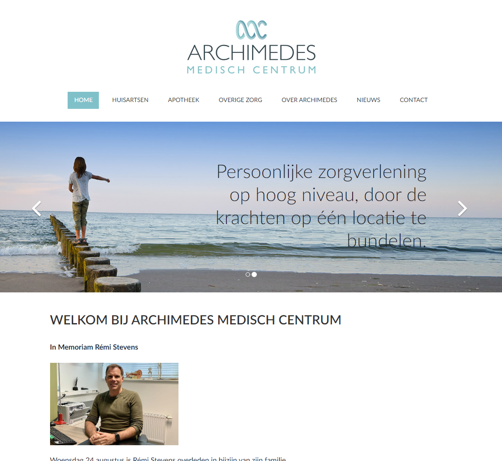
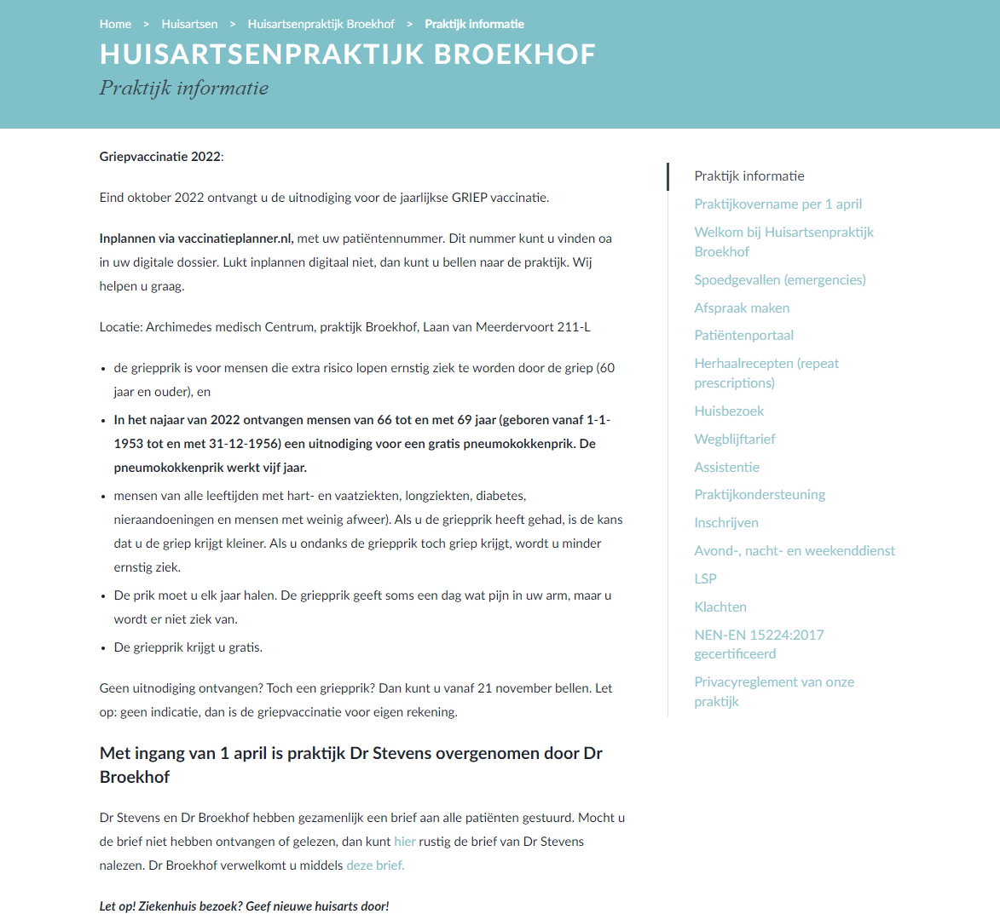
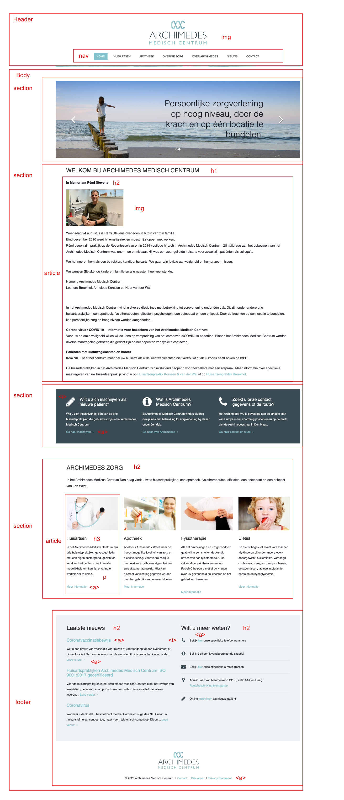
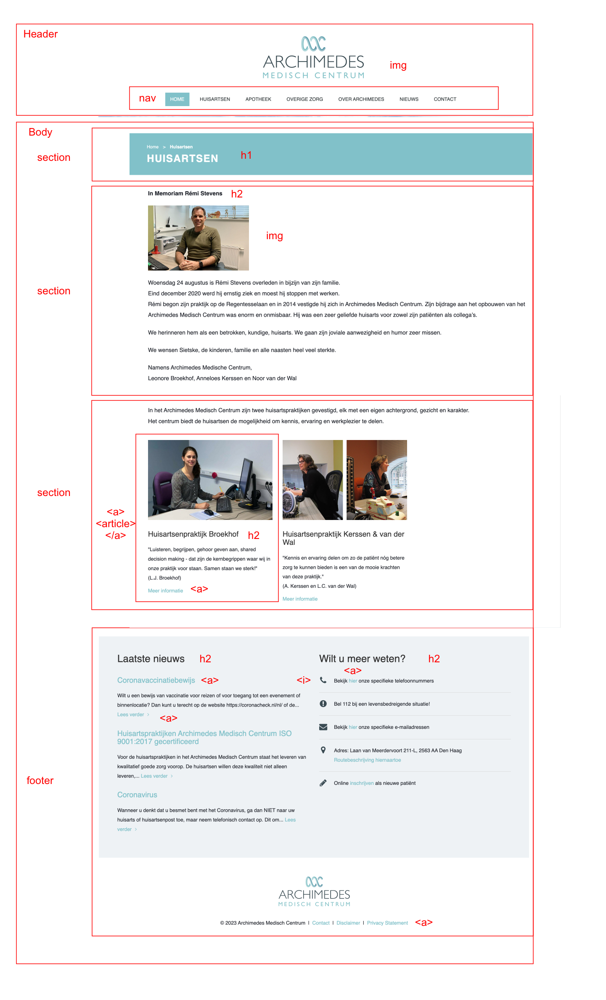

# Procesverslag

## Jort Broekhof

### Auteur:

Jort Broekhof

#### Je startniveau:

Zwart

#### Je focus:

Responsiveness

## De website

### Je opdracht:

Ik ga beide pagina's verbeteren, semantisch, responsive en toegankelijk maken. Deze complete website is ook een echte opdracht waar ik op dit moment mee bezig ben voor Archimedes.  
[Archimedes medisch centrum hoofdpagina](https://archimedes-mc.nl/)  
[Archimedes medisch centrum praktijk informatie Broekhof](https://archimedes-mc.nl/huisartsen/broekhof/praktijk-informatie/)

#### Screenshot(s) van de eerste pagina (small screen):

Archimedes hoofdpagina
 

#### Screenshot(s) van de tweede pagina (small screen):

Praktijk pagina Broekhof
 

## Toegankelijkheidstest 1/2 (week 1)

  
Toegankelijkheid Archimedes

### Bevindingen

#### Screenreader

Er zijn veel link elementen onzichtbaar voor de gebruiker en screenreader.
 
Alt tekst bij afbeeldingen is erg onduidelijk of simpelweg ontbrekend.
 
Carrousel is niet duidelijk voor voiceover.

#### Muis en Toetsenbord

Links in navigatie zijn tab navigatie toegankelijk.
 
Er zijn veel link elementen onzichtbaar voor de gebruiker, deze weet niet waar hij op gefocused is.
 

#### Motoriek (shocks, elastiekjes)

Bij slechte motoriek is de website nog steeds te navigeren alleen kost het meer moeite.
 

#### Visueel (brillen, contrast, kleurenblind, dark/light).

Website heeft hoog contrast niveau, conflicting kleuren die impact kunnen hebben op kleurenblindheid
 

Slecht zicht maakt de website slecht toegankelijk door onder andere kleine tekst en knoppen.
 
Tekst boven op afbeeldingen in de carrousel verandert de tekst op de afbeeldingen naar wit waardoor de tekst heel slecht te lezen is.
 
Automatisch dark mode via chrome extension werkt erg goed.
 

## Breakdownschets (week 1)

### Home pagina:

## Huisartsen pagina

## Voortgang 1 (week 2)

### In verband met ziekte niet gedaan.

## Voortgang 2 (week 3)

  
uitwerken voor 2e voortgang

### Stand van zaken

Website besproken met Sanne. 
Hierbij gekeken hoe ik vooral focus kan leggen op toegankelijkheid en hoe ik dit kan testen tegenover officiele organisaties. 

## Toegankelijkheidstest 2/2 (week 4)

  
uitwerken na test in 8e werkgroep

### Bevindingen

Lijst met je bevindingen die in de test naar voren kwamen (geef ook aan wat er verbeterd is):

#### Screenreader

Hier korte omschrijving (met indien nodig afbeeldingen)

Hier een omschrijving van hoe het opgelost kan worden (met indien nodig afbeeldingen)

#### Muis en Toetsenbord

Hier korte omschrijving (met indien nodig afbeeldingen)

Hier een omschrijving van hoe het opgelost kan worden (met indien nodig afbeeldingen)

#### Motoriek (shocks, elastiekjes)

Hier korte omschrijving (met indien nodig afbeeldingen)

Hier een omschrijving van hoe het opgelost kan worden (met indien nodig afbeeldingen)

#### Visueel (brillen, contrast, kleurenblind, dark/light).

Hier korte omschrijving (met indien nodig afbeeldingen)

Hier een omschrijving van hoe het opgelost kan worden (met indien nodig afbeeldingen)

## Voortgang 3 (week 4)

  
uitwerken voor 3e voortgang

  Tijdens het 3e voortgangsgesprek heb ik met Jeffrey gezeten en gekeken naar  mijn huidige website. Hier kwam al snel naar boven dat ik niet goed had begrepen dat classes en id's niet toegestaan waren en dat mijn HTML niet altijd semantisch correct was.
   
  Daarnaast liep ik achter bij een paar documentatie punten die nog moesten worden aangevuld.
   

## Eindgesprek (week 5)

  
uitwerken voor eindgesprek

### Je uitkomst - karakteristiek screenshots:

  

### Dit ging goed/Heb ik geleerd:

Korte omschrijving met plaatjes

  

### Dit was lastig/Is niet gelukt:

Korte omschrijving met plaatjes

  

## Bronnenlijst

  
continu bijhouden terwijl je werkt

Nb. Wees specifiek ('css-tricks' als bron is bijv. niet specifiek genoeg).

1. bron 1
2. bron 2
3. ...

